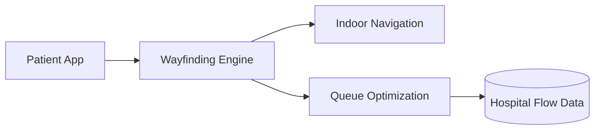

# Mahidol x Harvard — Health Systems Innovation Hackathon

> **Hospital wayfinding + patient flow optimization** — built for the 7th Mahidol x Harvard Health Systems Innovation Lab (Building High-Value Health Systems: Leveraging AI).

### Demo

### Context

- **Selected** among 196 teams/individuals nationwide (No. 63)
- Mentors: Prof. Rifat Atun (Harvard), NIA, True Digital, Microsoft
- 3–4 Apr 2026 @ Mahidol Faculty of Dentistry

### Architecture

---

**Phirawit Jitnarong — Strategic Full-Stack & AI Engineer**

xme176@gmail.com · 092-551-0427 · [LinkedIn](https://www.linkedin.com/in/%E0%B8%9E%E0%B8%B5%E0%B8%A3%E0%B8%A7%E0%B8%B4%E0%B8%8A%E0%B8%8D%E0%B9%8C-%E0%B8%88%E0%B8%B4%E0%B8%95%E0%B8%93%E0%B8%A3%E0%B8%87%E0%B8%84%E0%B9%8C-0000393a4) · [Fastwork](https://fastwork.co/user/bravforcode?source=search)

> Hiring for this stack? Let's talk — production hardened, 300k+ users shipped.